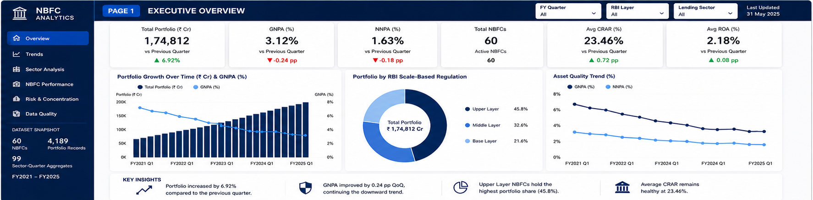
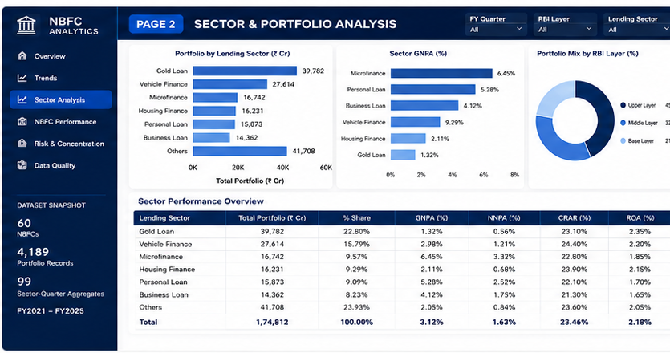
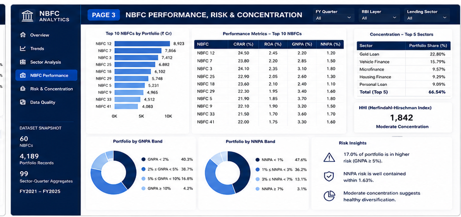

# 🏦 Indian NBFC Portfolio & Asset Quality Analytics

An end-to-end data analytics project exploring **portfolio growth, asset quality, capital adequacy, and concentration risk in India's Non-Banking Financial Company (NBFC) sector**.

The project demonstrates a complete analytics workflow using **Python, Pandas, SQL, SQLite, data-quality validation, and reproducible ETL pipelines**.

> **Project Status:** Python ETL and SQL analytics are complete. Power BI dashboard development is planned as the next phase.

---

## 🎯 Project Objective

The objective of this project is to build an analysis-ready NBFC portfolio dataset and use it to investigate questions such as:

* How has NBFC asset quality changed over time?
* Which lending segments carry higher credit risk?
* How is portfolio exposure distributed across RBI Scale-Based Regulation layers?
* Which entities or segments show higher GNPA concentration?
* How can raw and inconsistent financial data be transformed into reliable analytical tables?
* How can SQL window functions and aggregation techniques be applied to financial risk analysis?

---

## 🧰 Tech Stack

| Technology         | Usage                                           |
| ------------------ | ----------------------------------------------- |
| **Python**         | ETL pipeline and data-quality processing        |
| **Pandas**         | Cleaning, transformation and aggregation        |
| **NumPy**          | Numerical processing and missing-value handling |
| **SQL**            | Analytical queries and risk analysis            |
| **SQLite**         | Local analytical database                       |
| **Git & GitHub**   | Version control and project documentation       |
| **Power BI / DAX** | Planned dashboard and visualization layer       |

---

## 🏗️ Project Architecture

```text
Raw NBFC Portfolio Data
          │
          ▼
┌───────────────────────┐
│      Python ETL       │
│  Cleaning & Validation│
└───────────┬───────────┘
            │
            ▼
┌───────────────────────┐
│   Clean Data Tables   │
│                       │
│  • fact_portfolio     │
│  • dim_nbfc           │
│  • sector aggregates  │
└───────────┬───────────┘
            │
            ▼
┌───────────────────────┐
│    SQLite Database    │
│       + SQL           │
└───────────┬───────────┘
            │
            ▼
      Risk Analytics
            │
            ▼
     Power BI — Planned
```

---

## 📊 Dataset

The project contains an **NBFC × quarter × lending-sector analytical panel** covering FY2021–FY2025.

The entity-level data is modelled for analytical practice, while sector-level control figures are anchored to published RBI sector information.

### Current processed output

| Dataset                   |           Records |
| ------------------------- | ----------------: |
| NBFC dimension            |      **60 NBFCs** |
| Portfolio fact table      | **4,189 records** |
| Sector-quarter aggregates |    **99 records** |

> **Important:** Individual NBFC names and entity-level figures in this project are modelled for analytical demonstration. They should not be interpreted as official company disclosures.

---

## 🐍 Python ETL Pipeline

The main ETL pipeline is:

```text
python/etl_nbfc.py
```

The pipeline follows:

```text
Extract
   ↓
Clean
   ↓
Deduplicate
   ↓
Validate
   ↓
Load
```

### ETL operations

The pipeline performs:

* Raw CSV ingestion with controlled type handling
* Whitespace cleanup
* Missing-value standardisation
* Category standardisation
* Numeric conversion
* Mixed-date parsing
* Exact duplicate removal
* Business-key duplicate removal
* Range validation
* Invalid-record handling
* Median-based imputation
* Business-rule validation
* Data-quality reporting
* Fact and dimension table generation

The source contains deliberately messy data so that the project demonstrates realistic data-cleaning problems.

The ETL converts approximately **4,573 raw records into 4,189 validated analytical records**.

---

## ✅ Data Quality Framework

Instead of silently correcting invalid values, the ETL records detected issues and actions in:

```text
data/data_quality_report.csv
```

Examples of validations include:

* Missing critical identifiers
* Missing portfolio values
* Duplicate records
* Duplicate business keys
* Non-positive loan balances
* GNPA outside valid boundaries
* NNPA outside valid boundaries
* Invalid CRAR values
* Invalid ROA values
* NNPA greater than GNPA
* Invalid date formats

This makes the transformation process more transparent and auditable.

---

## 🗄️ SQL Analytics

Cleaned datasets are loaded into SQLite using:

```text
sql/load_db.py
```

The resulting analytical model includes:

```text
dim_nbfc
     │
     │ 1 : many
     ▼
fact_portfolio
```

with a pre-aggregated sector/quarter table for reporting.

The SQL analysis is available in:

```text
sql/nbfc_analytics.sql
```

### SQL concepts demonstrated

The SQL layer includes:

* Common Table Expressions (**CTEs**)
* `LAG()` for period-over-period analysis
* `RANK()` for performance ranking
* `NTILE()` for risk segmentation
* Moving averages using window frames
* Conditional aggregation
* Portfolio-weighted metrics
* Concentration-risk analysis
* Herfindahl-Hirschman Index (**HHI**)
* Cohort-style analysis
* Data-quality assertions

---

## 🔍 Selected Analytical Findings

Analysis of the dataset highlights several sector-level patterns.

### Asset quality improvement

Sector GNPA declines substantially across the period, moving from approximately **6.4% in FY2021 to 3.1% by FY2025**.

This suggests a meaningful improvement in overall asset quality across the modelled period.

### Growth alongside improving credit quality

The dataset shows that portfolio expansion can occur alongside falling GNPA levels, allowing analysis of the relationship between credit growth and asset quality.

### Risk varies by lending segment

Higher-risk segments include areas such as:

* Microfinance
* Unsecured / personal lending

Lower-risk segments in the model include areas such as:

* Gold lending
* Housing finance

This makes sector allocation an important dimension when evaluating portfolio risk.

### Portfolio concentration

The project also analyses portfolio concentration across:

* NBFC entities
* Lending sectors
* Regulatory layers
* Time periods

using SQL-based concentration measures including HHI.

---

## 📂 Repository Structure

```text
nbfc-analytics/
│
├── data/
│   ├── raw_nbfc_portfolio.csv
│   ├── rbi_sector_controls.csv
│   ├── fact_portfolio.csv
│   ├── dim_nbfc.csv
│   ├── agg_sector_quarter.csv
│   └── data_quality_report.csv
│
├── python/
│   ├── etl_nbfc.py
│   └── make_raw_data.py
│
├── sql/
│   ├── load_db.py
│   └── nbfc_analytics.sql
│
├── powerbi/
│   ├── DASHBOARD_GUIDE.md
│   └── measures.dax
│
├── .gitignore
└── README.md
```


## 📈 Example Pipeline Output

A successful database load produces approximately:

```text
loaded dim_nbfc: 60 rows
loaded fact_portfolio: 4,189 rows
loaded agg_sector_quarter: 99 rows
built sql/nbfc.db
```

---

# 📊 Power BI Dashboard

The project includes a three-page Power BI dashboard designed to provide an executive-to-entity view of NBFC portfolio performance, asset quality, sector exposure, regulatory layers, and concentration risk.

The dashboard is built on the validated analytical tables generated through the Python ETL pipeline and SQL data model.

---

## Page 1 — Executive Overview

The Executive Overview provides a high-level view of the NBFC portfolio and overall asset quality.

### Key KPIs

- Total Portfolio
- GNPA
- NNPA
- Total NBFCs
- Average CRAR
- Average ROA

### Key analysis

- Portfolio growth over time
- GNPA trend
- Portfolio distribution by RBI Scale-Based Regulation layer
- GNPA and NNPA asset-quality trends
- Executive-level portfolio insights



---

## Page 2 — Sector & Portfolio Analysis

This page provides a detailed view of portfolio exposure and asset quality across lending sectors and regulatory layers.

### Key analysis

- Portfolio by lending sector
- Sector-level GNPA
- Portfolio mix by RBI layer
- Sector performance overview
- Portfolio share
- GNPA and NNPA
- CRAR
- ROA

### Business questions

- Which lending sectors have the largest portfolio exposure?
- Which sectors show higher GNPA?
- How does portfolio exposure vary across RBI regulatory layers?
- Which sectors combine significant portfolio exposure with higher credit risk?



---

## Page 3 — NBFC Performance, Risk & Concentration

This page focuses on entity-level performance, risk segmentation, and portfolio concentration.

### Key analysis

- Top NBFCs by portfolio
- Entity-level CRAR
- Entity-level ROA
- GNPA and NNPA comparison
- Portfolio by GNPA risk band
- Portfolio by NNPA risk band
- Top-5 sector concentration
- HHI concentration analysis
- Risk insights

### Business questions

- Which NBFCs have the largest portfolios?
- Which entities show higher GNPA or NNPA?
- Which entities demonstrate stronger capital adequacy and profitability?
- How concentrated is the overall portfolio?
- What proportion of the portfolio falls into higher-risk GNPA and NNPA bands?



---

## 📌 Dashboard Navigation

The three-page report follows an executive-to-detail analytical flow:

Executive Overview
        ↓
Sector & Portfolio Analysis
        ↓
NBFC Performance, Risk & Concentration

This allows users to move from overall portfolio performance to sector-level analysis and finally to entity-level risk and concentration analysis.
---

## 📚 Data Context

Sector-level reference information used for this analytical exercise is based on publicly available material from the **Reserve Bank of India (RBI)**, including publications covering the Indian NBFC sector and Scale-Based Regulation framework.

This repository is intended as a **data analytics portfolio project and educational case study**, not as an official source of company-level financial information.

---

## 👤 Author

**Hari A**

Data Analytics Portfolio Project

**Skills demonstrated:** Python · Pandas · SQL · SQLite · ETL · Data Cleaning · Data Quality · Financial Analytics · Git/GitHub

---

⭐ If you found this project useful, feel free to explore the code and SQL analysis.

